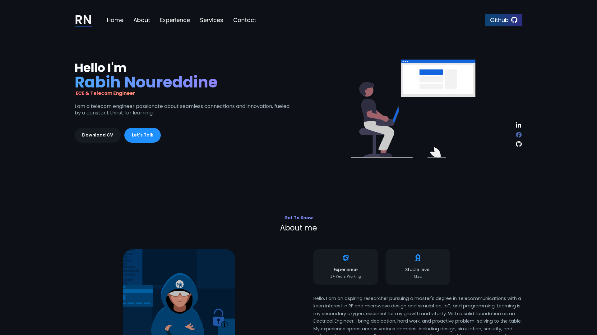

## Hi There! I am Rabih 

<!--- > **Donation :**
> Do you want to support me?

  

 --->

<!---  --->

<!------>

### Languages and Tools:

 
 

### Softwares:

 
 

 
 

### Reach Me

  
  

### GitHub Stats

  

### My New Portfolio
<!-- [

](https://rabihnd.netlify.app/) -->

